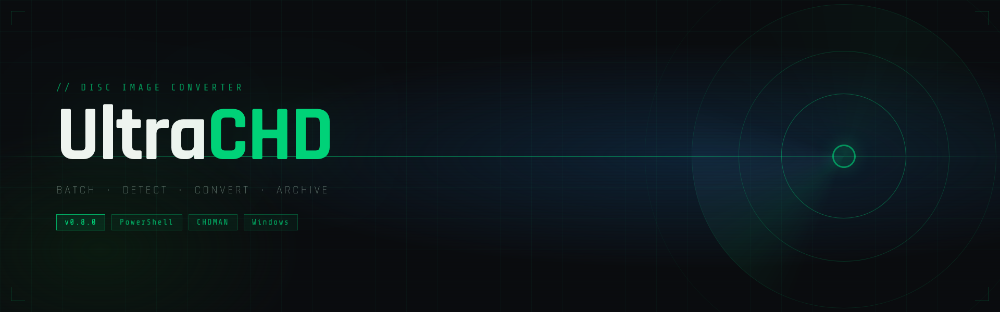

# UltraCHD



[](https://github.com/smokeluce/UltraCHD)
[](https://github.com/PowerShell/PowerShell)
[](https://github.com/smokeluce/UltraCHD)
[](https://www.mamedev.org/)
[](LICENSE)

A fast, reliable, and modular tool for converting disc images into CHD format with clean logging, automatic system detection, and a workflow designed for archival stability.

UltraCHD is built for users who want a deterministic, repeatable, and low-friction way to batch-convert disc images using CHDMAN. It emphasizes clarity, safety, and expressive output — making it ideal for personal archives, emulation setups, and long-term preservation.

---

## Features

- **Automatic system detection** — Identifies CD-i, PS1, and CD-i Ready (all-audio) discs via sector-level analysis
- **Batch CHD conversion** — Processes all ZIPs in a directory in a single run
- **Robust logging** — Color-coded output with per-step status for every disc
- **Error handling and reporting** — Failed archives are quarantined to `UltraCHD_Failed/` automatically
- **Done tracking** — Successfully converted archives are moved to `UltraCHD_Done/`
- **Modular architecture** — Clean separation of detection logic and conversion logic
- **Deterministic behavior** — Safe temp directory handling with automatic cleanup

---

## Requirements

- Windows
- PowerShell 5+ or PowerShell 7+
- [CHDMAN](https://www.mamedev.org/) (included with MAME) — place `chdman.exe` in the same folder as the script
- Sufficient disk space for temporary extraction and output CHDs

---

## Usage

Place `convert.ps1`, `UltraCHD.bat`, and `chdman.exe` in the same folder as your ZIP archives, then run:

```bat
.\UltraCHD.bat
```

Or directly via PowerShell:

```powershell
.\convert.ps1
```

### Output structure

```
YourFolder/
├── chdman.exe
├── convert.ps1
├── UltraCHD.bat
├── GameName.chd              ← converted output
├── UltraCHD_Done/            ← source ZIPs after successful conversion
└── UltraCHD_Failed/          ← source ZIPs if conversion failed
```

---

## System Detection

UltraCHD reads the volume descriptor from the disc's BIN file to identify the system:

| Detection method | Result |
|---|---|
| `CD-RTOS` or `CD-I` in sector header | CD-i |
| All-audio CUE with no data track | CD-i Ready |
| MODE2 data track, no CD-i markers | PS1 |
| ISO file with CD-i markers | CD-i |
| Other | Unknown |

---

## Project Goals

UltraCHD aims to be:

- **Fast** — minimal overhead, direct CHDMAN passthrough
- **Safe** — no destructive operations; originals are moved, never deleted
- **Modular** — detection and conversion are cleanly separated
- **Archival-grade** — deterministic output suitable for long-term preservation

### Planned features

- Per-system configuration modules
- Verification modes (CHD integrity checking)
- Reporting tools
- GUI front-end
- Integration with other archival utilities

---

## Versioning

Current version: **0.8.0**

---

## Acknowledgments

UltraCHD builds on the excellent work of the [MAME team](https://www.mamedev.org/) and the CHDMAN utility.

---

## License

To be determined.
