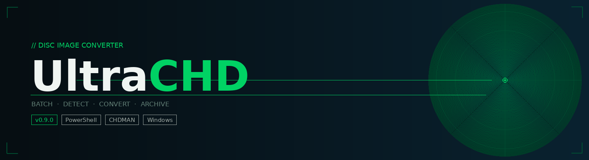

# UltraCHD



[](https://github.com/smokeluce/UltraCHD)
[](https://github.com/PowerShell/PowerShell)
[](https://github.com/smokeluce/UltraCHD)
[](https://www.mamedev.org/)
[](LICENSE)


A fast, reliable, and modular tool for converting disc images into CHD format with clean logging, automatic system detection, and a workflow designed for archival stability.

UltraCHD is built for users who want a deterministic, repeatable, and low-friction way to batch-convert disc images using CHDMAN. It emphasizes clarity, safety, and expressive output — making it ideal for personal archives, emulation setups, and long-term preservation.

---

## Features

- **Automatic system detection** — Identifies 12 systems via sector-level header analysis with no false positives
- **Batch CHD conversion** — Processes all archives in a directory in a single run
- **Multi-format archive support** — Handles `.zip` natively; `.7z` via `7za.exe`; `.rar` via `UnRAR.exe` (each required only if you use that format)
- **Robust logging** — Color-coded output with per-step status for every disc
- **Categorized error handling** — Failed archives quarantined to `UltraCHD_Failed/Archives`, `/Conversion`, or `/Validation`
- **Done tracking** — Successfully converted archives are moved to `UltraCHD_Done/`
- **Correct CHDMAN routing** — Automatically selects `createcd` or `createdvd` based on detected system
- **Modular architecture** — Clean separation of detection logic and conversion logic
- **Deterministic behavior** — Safe per-game temp directories with automatic cleanup

---

## Requirements

- Windows
- PowerShell 5+ or PowerShell 7+
- [CHDMAN](https://www.mamedev.org/) (included with MAME) — place `chdman.exe` in the same folder as the script
- `7za.exe` (standalone 7-Zip console binary) — required for `.7z` archives; not bundled, download from [7-zip.org](https://www.7-zip.org/download.html)
- `UnRAR.exe` (freeware command-line UnRAR by RARlab) — required for `.rar` archives; not bundled, download from [rarlab.com](https://www.rarlab.com/rar_add.htm) ("UnRAR for Windows")
- Sufficient disk space for temporary extraction and output CHDs

---

## Usage

Place `UltraCHD.ps1`, `UltraCHD.bat`, and `chdman.exe` in the same folder as your archives, then run:

```bat
.\UltraCHD.bat
```

Or directly via PowerShell:

```powershell
.\UltraCHD.ps1
```

### What UltraCHD does

When run, UltraCHD processes every archive in the current directory in sequence. For each one it:

1. **Extracts** the archive to a temporary working directory
2. **Identifies** the disc image format (`.cue`, `.gdi`, `.iso`, `.img`, or `.bin`)
3. **Detects** the system by reading sector-level signatures from the disc data — no manual tagging required
4. **Converts** the disc image to CHD using the correct CHDMAN command for the detected system
5. **Moves** the source archive to `UltraCHD_Done/` on success, or quarantines it to the appropriate `UltraCHD_Failed/` subfolder on failure
6. **Cleans up** the temporary working directory regardless of outcome

Supported archive formats: `.zip`, `.7z`, `.rar` — one disc per archive. Loose source files (`.cue`, `.gdi`, `.iso`, `.img`, `.bin`) placed directly in the script folder are also processed without an archive wrapper.

### Output structure

```
YourFolder/
├── chdman.exe
├── 7za.exe                   ← required for .7z archives
├── UnRAR.exe                 ← required for .rar archives (optional)
├── UltraCHD.ps1
├── UltraCHD.bat
├── GameName.chd              ← converted output
├── UltraCHD_Archives/        ← source archives after successful extraction
├── UltraCHD_Failed/
│   ├── Archives/             ← archives that could not be extracted
│   ├── Conversion/           ← archives where CHD creation failed
│   └── Validation/           ← archives that failed post-conversion checks
```

---

## Supported Systems

UltraCHD reads disc image headers to identify the system automatically — no manual tagging or folder organization required. Detection uses sector-level signatures with ordered priority to eliminate false positives.

| System | Formats | Detection method |
|---|---|---|
| PlayStation 1 | `.cue`/`.bin`, `.iso` | Fallback after all other signatures ruled out |
| PlayStation 2 (CD) | `.cue`/`.bin`, `.iso` | `BOOT2` in `SYSTEM.CNF` |
| PlayStation 2 (DVD) | `.cue`/`.bin`, `.iso` | UDF filesystem markers (`NSR02`/`NSR03`) |
| PSP | `.iso` | `UMD_DATA.BIN` or `PSP_GAME` string |
| Sega Saturn | `.cue`/`.bin`, `.iso` | `SEGA SEGASATURN` at sector 0 |
| Sega CD / Mega-CD | `.cue`/`.bin`, `.iso` | `SEGADISCSYSTEM` at sector 0 |
| Dreamcast | `.gdi`, `.cue`/`.bin` | `.gdi` extension or `SEGA SEGAKATANA` sector scan |
| PC Engine CD / TurboGrafx-CD | `.cue`/`.bin`, `.img` | `PC Engine CD-ROM SYSTEM` at sector 1 |
| Neo Geo CD | `.cue`/`.bin`, `.img` | `IPL.TXT` in ISO 9660 directory records |
| CD-i | `.cue`/`.bin`, `.iso` | `CD-RTOS` or `CD-I` in volume descriptor |
| CD-i Ready (all-audio) | `.cue` | All-audio CUE with no data tracks |
| 3DO | `.cue`/`.bin`, `.iso` | Opera filesystem disc label header at sector 0 |

---

## Known Limitations

These edge cases are not handled in 0.9.0. Archives that trigger them will either be quarantined or produce an incomplete CHD — source files are never deleted, so nothing is lost.

**DiscJuggler `.cdi` images**
`.cdi` is a Dreamcast disc format created by DiscJuggler. Modern chdman (0.139+) cannot convert it — it reads the file but produces zero tracks and an empty output. UltraCHD identifies `.cdi` files by their footer signature (last 4 bytes: `0x80000004` for v2.0, `0x80000006` for v3.x) and quarantines them with a clear error message rather than producing a corrupt CHD. **Workaround:** convert the `.cdi` to GDI or BIN/CUE using a tool such as [CDI2GDI](https://github.com/rizaumami/cdi2gdi) before running UltraCHD.

**Deeply nested archives**
UltraCHD flattens one level of subdirectory nesting after extraction. Archives with two or more levels of nesting (e.g. `GameName/Disc1/game.cue`) will cause the CUE and its BIN files to be separated during flattening, resulting in a failed conversion. **Workaround:** ensure archives contain files at the root or one folder deep.

**Multi-disc games in a single archive**
If two or more discs are packed into one archive, only the first CUE or game file found will be processed. The remaining discs will be silently ignored. **Workaround:** one disc per archive.

**ISO + WAV without a CUE sheet**
Some tools produce a standalone ISO for the data track alongside loose WAV audio track files, with no CUE sheet to describe the layout. UltraCHD will detect and convert the ISO correctly but the WAV audio tracks will be omitted from the CHD entirely. **Workaround:** ensure a valid CUE sheet is present that references both the ISO and WAV files.

**Bare BIN with no CUE sheet**
A lone `.bin` file with no accompanying `.cue` will be detected and passed to CHDMAN as-is. For single-track data discs this is fine. For multi-track titles (games with audio tracks in separate files) the additional tracks will be missing from the output CHD. **Workaround:** ensure a CUE sheet is present for any multi-track disc.

**CUE filenames with special characters (unquoted references)**
CUE sheets that reference their data files without quotes and whose filenames contain spaces will fail to parse correctly. Quoted filenames are handled reliably. **Workaround:** most modern ripping tools quote filenames by default — if a CUE fails to parse, check that the FILE reference is quoted.

---

## Project Goals

UltraCHD aims to be:

- **Fast** — minimal overhead, direct CHDMAN passthrough
- **Safe** — no destructive operations; originals are moved, never deleted
- **Modular** — detection and conversion are cleanly separated
- **Archival-grade** — deterministic output suitable for long-term preservation

### Planned features

- Per-system configuration modules
- Verification modes (CHD integrity checking)
- Reporting tools
- GUI front-end
- Integration with other archival utilities

---

## Versioning

Current version: **0.9.0**

---

## Author

UltraCHD is written and maintained by **Paul Swonger** ([@smokeluce](https://github.com/smokeluce)).

---

## Acknowledgments

UltraCHD builds on the excellent work of the [MAME team](https://www.mamedev.org/) and the CHDMAN utility.

---

## License

UltraCHD (the PowerShell and batch scripts in this repository) is released under the [MIT License](LICENSE).

This repository also includes a redistributed binary of `chdman.exe`, developed by the MAME team and licensed under the [GNU General Public License, version 2 (GPL-2.0)](https://github.com/mamedev/mame/blob/master/COPYING). UltraCHD does not modify or incorporate any MAME source code — `chdman.exe` is invoked as a standalone external process. It remains the exclusive work of the MAME team and is subject to GPL-2.0 independently of this project.

See [LICENSE](LICENSE) for full terms and third-party notices.
